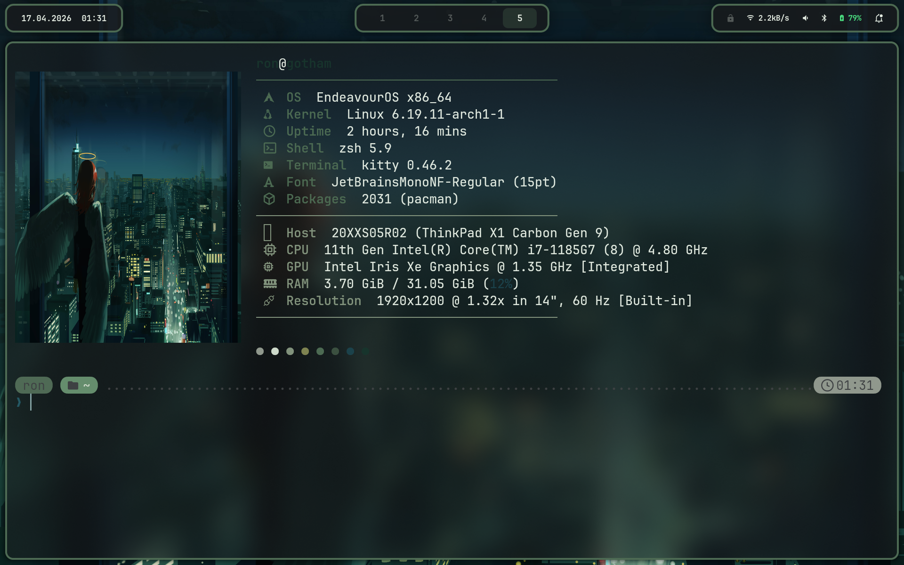
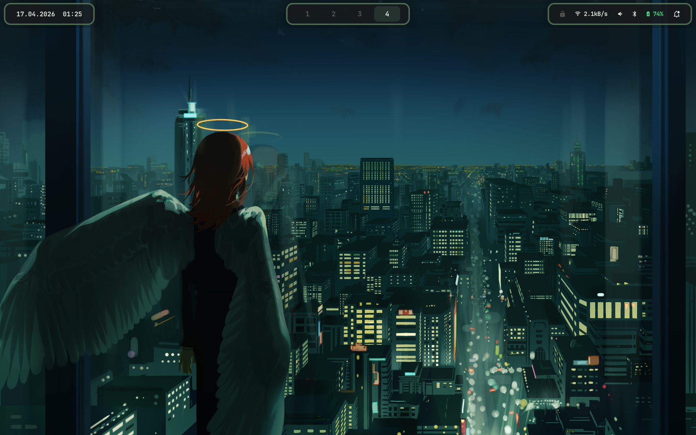
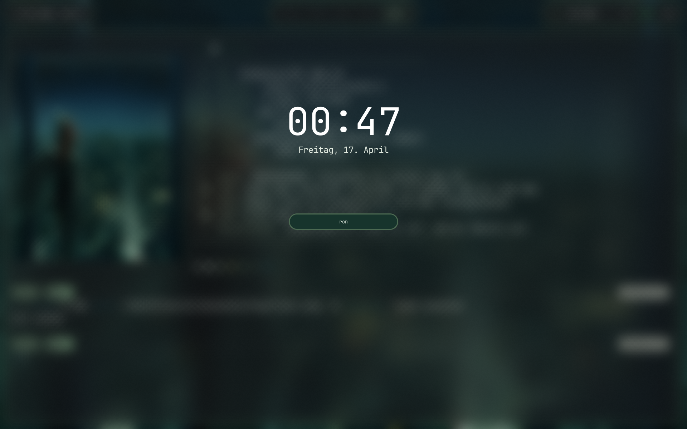

<div align="center">

<h1>dotfiles</h1>

<p><em>Arch Linux · Hyprland · Wayland-native · Dynamic Wallust theming</em></p>

<p>
  
  
  
</p>

<p>
  
  
  
  
</p>

<p>
  
</p>

<p>
  Every wallpaper change regenerates the full color scheme — borders, bar,<br/>
  launcher, terminal, lock screen — live, with zero manual intervention.
</p>

</div>

---

## Screenshots

<table>
  <tr>
    <td align="center"><strong>Desktop Overview</strong></td>
    <td align="center"><strong>Terminal + Fastfetch</strong></td>
  </tr>
  <tr>
    <td></td>
    <td></td>
  </tr>
  <tr>
    <td align="center"><strong>Rofi Launcher</strong></td>
    <td align="center"><strong>Hyprlock</strong></td>
  </tr>
  <tr>
    <td></td>
    <td></td>
  </tr>
</table>

---

## What Makes This Setup Different

### Dynamic Theming Pipeline

One command — `wallust run wallpaper.jpg` — propagates a full 16-color scheme derived from the wallpaper to every component simultaneously. No manual color picking, no config edits.

```
Wallpaper
   │
   ▼
wallust run wallpaper.jpg
   │
   ├──▶ Kitty terminal       (.config/wallust/templates/colors-kitty.conf)
   ├──▶ Waybar CSS           (colors-waybar.css + waybar-style.css)
   ├──▶ Rofi RASI            (colors-rofi-dark.rasi)
   ├──▶ Swaync CSS           (swaync-style.css)
   ├──▶ SwayOSD CSS          (swayosd.css)
   ├──▶ Hyprland borders     (pywal-hyprland-colors.sh → hyprctl)
   ├──▶ Hyprlock             (pywal-hyprlock-colors.sh)
   ├──▶ Starship prompt      (starship-color-gen.sh)
   └──▶ Zen Browser          (zen-wal-refresh.sh)
```

Color templates live in `.config/wallust/templates/` — edit them to customize which color roles map to which UI elements.

### Rofi as System Control Center

Almost every system action is a Rofi menu. No floating panels, no system tray dialogs — just keyboard-driven fuzzy menus.

| Menu | Keybind |
|------|---------|
| App Launcher | `Super + Space` |
| Wallpaper Picker | `Super + G` |
| Next Wallpaper | `Super + Shift + S` |
| Power Menu | `Super + Shift + L` |
| Package Installer | `Super + P` |
| Clipboard History | `Super + V` |
| AI Assistant | `Super + A` |
| MCP Management | `Super + M` |
| Resolution | `Super + R` |
| WiFi, Bluetooth, VPN | (launched from scripts) |

### Modular Hyprland Config

The Hyprland config is split into 8 self-contained modules under `.config/hypr/modules/`:

`autostart` · `environment` · `hyprland-pywal` · `inputs` · `keybinds` · `programs` · `style` · `windows`

Add, remove, or override individual modules without touching the main `hyprland.conf` entry point.

### AI + MCP Integration

`Super+A` opens an AI assistant via Rofi. `Super+M` manages MCP servers with a custom Python helper and Rofi menu. Scripts live in `.config/scripts/rofi/ai/` and `.config/scripts/rofi/mcp.sh`.

### Dynamic Monitor Profiles

`hyprdynamicmonitors` automatically switches between laptop-only and docked display configurations. Machine-specific monitor config is intentionally not tracked in this repo.

---

## Stack

| Component | Tool |
|-----------|------|
| Window Manager | [Hyprland](https://hyprland.org/) |
| Terminal | [Kitty](https://sw.kovidgoyal.net/kitty/) |
| Shell | ZSH + [Oh My ZSH](https://ohmyz.sh/) + [Starship](https://starship.rs/) |
| Editor | [Neovim](https://neovim.io/) (LazyVim) |
| Code Editor (GUI) | [Zed](https://zed.dev/) |
| Status Bar | [Waybar](https://github.com/Alexays/Waybar) |
| App Launcher | [Rofi](https://github.com/davatorium/rofi) (Wayland fork) |
| Notifications | [swaync](https://github.com/ErikReider/SwayNotificationCenter) |
| Color Theming | [Wallust](https://codeberg.org/explosion-mental/wallust) (pywal-compatible) |
| Wallpaper | [swww](https://github.com/LGFae/swww) |
| Lock Screen | [Hyprlock](https://github.com/hyprwm/hyprlock) + [Hypridle](https://github.com/hyprwm/hypridle) |
| File Manager | [Yazi](https://yazi-rs.github.io/) (TUI) / Nautilus (GUI) |
| Browser | [Zen Browser](https://zen-browser.app/) |
| Git TUI | [Lazygit](https://github.com/jesseduffield/lazygit) |
| Multiplexer | [Tmux](https://github.com/tmux/tmux) |
| System Info | [Fastfetch](https://github.com/fastfetch-cli/fastfetch) |
| Monitor Mgmt | [hyprdynamicmonitors](https://github.com/zakissimo/hyprdynamicmonitors) |
| MCP Management | mcpy + Rofi menu |

---

## Keybindings

### Applications

| Keybind | Action |
|---------|--------|
| `Super + T` | Terminal (Kitty) |
| `Super + B` | Browser (Zen) |
| `Super + Shift + B` | Browser (Private) |
| `Super + C` | Code Editor (Zed) |
| `Super + D` | Discord |
| `Super + N` | Notes (Obsidian) |
| `Super + Shift + N` | Document Editor (LibreOffice) |
| `Super + E` | File Manager (Yazi — dropdown) |
| `Super + Shift + E` | File Manager (Nautilus) |
| `Super + Shift + T` | Taskwarrior (dropdown) |

### Rofi Menus

| Keybind | Action |
|---------|--------|
| `Super + Space` | App Launcher |
| `Super + G` | Wallpaper Picker |
| `Super + Shift + S` | Next Wallpaper |
| `Super + P` | Package Installer |
| `Super + V` | Clipboard History |
| `Super + A` | AI Assistant |
| `Super + M` | MCP Management |
| `Super + R` | Resolution |
| `Super + Shift + L` | Power Menu |

### System

| Keybind | Action |
|---------|--------|
| `Super + L` | Lock Screen |
| `Super + F9` | Night Mode (4500K) |
| `Super + F10` | Night Mode (3000K) |
| `Super + Shift + F9` | Night Mode Off |
| `Print` | Screenshot (area select) |
| `Shift + Print` | Screen Recording |

### Window Management

| Keybind | Action |
|---------|--------|
| `Super + Q` | Close Window |
| `Super + F` | Fullscreen |
| `Super + Arrow Keys` | Move Focus |
| `Super + 1–9` | Switch Workspace |
| `Super + Shift + 1–9` | Move Window to Workspace |
| `Super + LMB` | Move Window (drag) |
| `Super + RMB` | Resize Window (drag) |
| `Super + Scroll` | Cycle Workspaces |

### Media Keys

| Key | Action |
|-----|--------|
| Volume Up/Down/Mute | Audio (via SwayOSD) |
| Mic Mute | Microphone |
| Brightness Up/Down | Screen brightness (via SwayOSD) |
| Play/Pause/Next/Prev | Media control (playerctl) |

---

## Installation

> **Prerequisites:** Arch Linux with a working Wayland session. Running `stow .` before installing dependencies will create broken symlinks.

### 1. Install dependencies

**pacman:**
```bash
sudo pacman -S hyprland kitty waybar rofi-wayland neovim yazi zsh starship tmux jq \
  swww swaync hypridle hyprlock wallust nautilus gum fzf plocate \
  hyprpolkitagent hyprsunset \
  brightnessctl playerctl wl-clipboard grim slurp grimblast \
  bluez bluez-utils networkmanager gnome-keyring \
  fastfetch lazygit btop
```

**AUR (yay):**
```bash
yay -S oh-my-zsh-git zsh-you-should-use hyprpicker zen-browser-bin taskwarrior-tui
```

**Oh My ZSH plugins:**
```bash
git clone https://github.com/zsh-users/zsh-autosuggestions \
  ${ZSH_CUSTOM:-~/.oh-my-zsh/custom}/plugins/zsh-autosuggestions

git clone https://github.com/zsh-users/zsh-syntax-highlighting \
  ${ZSH_CUSTOM:-~/.oh-my-zsh/custom}/plugins/zsh-syntax-highlighting

git clone https://github.com/MichaelAquilina/zsh-you-should-use \
  ${ZSH_CUSTOM:-~/.oh-my-zsh/custom}/plugins/you-should-use

git clone https://github.com/fdellwing/zsh-bat \
  ${ZSH_CUSTOM:-~/.oh-my-zsh/custom}/plugins/zsh-bat
```

### 2. Clone & stow

```bash
git clone https://github.com/rs3c/dotfiles.git ~/dotfiles
cd ~/dotfiles
stow .
```

### 3. Set ZSH as default shell

```bash
chsh -s $(which zsh)
```

### 4. Set your wallpaper and generate colors

```bash
wallust run /path/to/wallpaper.jpg
```

This generates color schemes for Hyprland, Waybar, Rofi, Kitty, Hyprlock, Starship, and more — automatically.

### 5. Monitor config (machine-specific, not tracked)

Create `~/.config/hypr/modules/monitors.conf`:

```ini
monitor=DP-1,2560x1440@144,0x0,1
monitor=,preferred,auto,1
```

### 6. Face icon for lock screen (optional)

```bash
cp your-photo.jpg ~/.face.icon   # shown as circle on Hyprlock
```

---

## Structure

```
dotfiles/
├── .config/
│   ├── hypr/
│   │   ├── hyprland.conf           # Entry point
│   │   ├── hyprlock.conf           # Lock screen
│   │   ├── hypridle.conf           # Idle daemon
│   │   ├── modules/                # 8 config modules (keybinds, style, env, …)
│   │   └── scripts/                # Hyprland-specific scripts (dropdown, etc.)
│   ├── hyprdynamicmonitors/        # Laptop/dock display profiles
│   │   └── hyprconfigs/            # docked_closed, fallback, laptop_open
│   ├── fastfetch/                  # System info display
│   ├── kitty/                      # Terminal
│   ├── nvim/                       # Neovim (LazyVim)
│   ├── rofi/                       # Launcher themes (wallust-aware RASI files)
│   ├── scripts/
│   │   ├── rofi/                   # Rofi menu scripts
│   │   │   ├── ai/                 # AI assistant (askai.sh)
│   │   │   ├── launcher.sh
│   │   │   ├── wallpaper_switcher.sh
│   │   │   ├── power.sh
│   │   │   ├── wifi.sh
│   │   │   ├── bluetooth.sh
│   │   │   ├── vpn.sh
│   │   │   ├── mcp.sh
│   │   │   ├── clipboard.sh
│   │   │   └── install-launcher.sh
│   │   └── installer/              # Package installer helpers
│   ├── starship/                   # Shell prompt + wallust palette
│   ├── swaync/                     # Notification center
│   ├── tmux/                       # Terminal multiplexer
│   ├── wallust/
│   │   └── templates/              # Color templates for each component
│   ├── waybar/                     # Status bar (3-island layout)
│   ├── yazi/                       # TUI file manager
│   └── zed/                        # Code editor (settings.json gitignored)
├── .zshrc
├── .zprofile
├── LICENSE
└── .stow-local-ignore
```

---

## Notes

- `zed/settings.json` is gitignored — it contains API keys. Copy `settings.json.example` as a starting point.
- Monitor config (`monitors.conf`) is machine-specific and not tracked.
- The Tmux prefix is `Ctrl+Space` (not the default `Ctrl+B`).
- Wallust templates in `.config/wallust/templates/` define which color roles map to which UI variables — edit these to customize color behavior without changing any app config.
- Generated files (Waybar CSS, Swaync CSS, Yazi theme, Hyprland pywal config) are excluded from stow — they are created on first `wallust run`.
